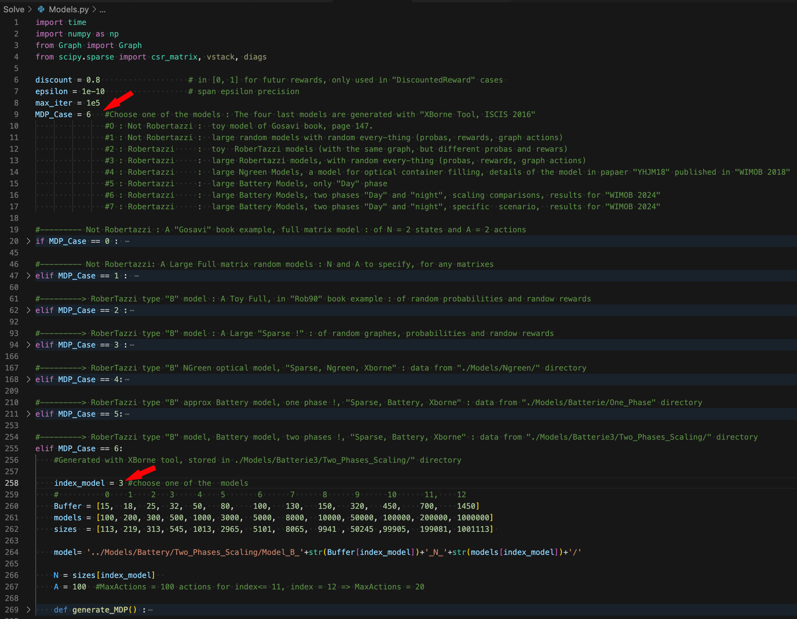
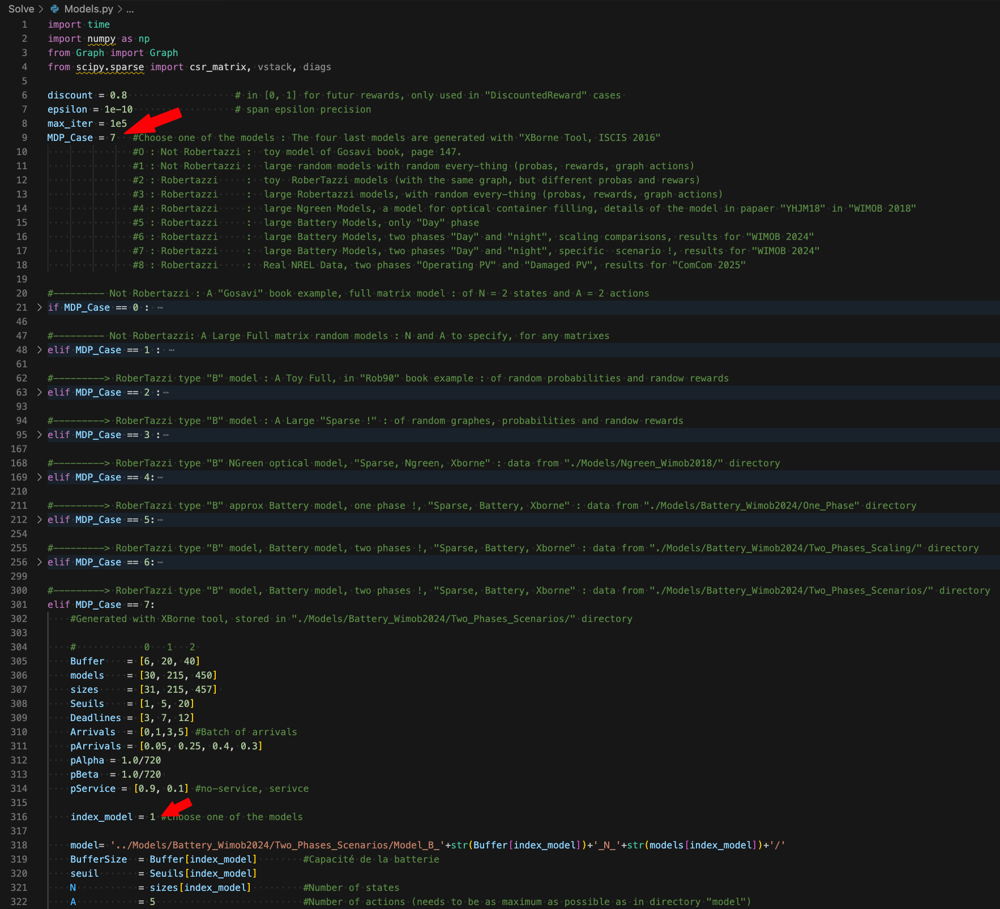

# MDP Battery and Ngreen Models  

## I - Goal
 
This framework facilitates the resolution of large-scale stochastic decision-making problems, specifically Markov Decision Processes (MDPs) with a particular structure. Typically, the transition graph for each action exhibits a particular structure; that is, all cycles within the graph pass through a common state. In our models, this common state represents an empty container in the Green model or an empty battery in the Battery model. Details about the NGreen model can be found in [1], though it is discussed solely in the context of Markov chain modeling. However, details of the Battery model are provided in [2], which specifically addresses an MDP (Markov Decision Process) problem, making it much more suitable for this framework. The Battery MDP model aims to find the optimal policy for selling energy for an off-grid telecom operator. It involves balancing positive rewards from selling battery (hence replacing it with new empty one) energy against negative rewards, as the battery will no longer be available to power its current infrastructure. Additionally, there is a penalty for packet loss, i.e., when energy packets arrive while the current battery is full.

## II - Project architecture

Tree of the most important files and folder in the project's repository :

```
/
├─┬─Models/: To store all MDP models (just a snapchot of models ... the original directory is about 18Go of data)
│ ├─- Ngreen/: To store all Ngreen MDP models (paper [1])
│ │     ├─-Model_N_50: Model with 50 states, taking maximum 100 actions
│ │     ├─-Model_N_500: Model with 500 states, taking maximum 100 actions
│ │     ├─- ...
│ │     └─ Model_N_100000: Model with 100 000 states, taking maximum 100 actions
│ └── Battery/: To store all Battery MDP models (paper [2])
│       ├─-One_Phase : different models for one phase battery : Model_B_6_N_14, Model_B_8_N_20, ... Model_B_1000_N_160000
│       ├─-Two_Phases_Scaling : different models for two phases battery : Model_B_15_N_100, Model_B_18_N_200, ... Model_B_700_N_200000  
│       └─-Two_Phases_Scenarios : different models for two phases battery : Model_B_6_N_30, Model_B_20_N_215  
│ 
├─┬─Solve/: Source folder.
│ ├─-Graph.py: reads Rii matrix storage from '/Models', converte to sparse_row.
│ ├──Models.py: creates an MDP models, needs Graph.py to read external models 
│ ├──AverageRewardFull.py: algorithms to solve average reward MDPs in Full storage
│ ├──AverageRewardSparse.py: algorithms to solve average reward MDPs in Sparse storage
│ │──Plots.py: some util functions to draw 2d (or 3d) heatmaps
│ └──Launcher.py: The launcher programm
│ 
├─┬─ Results/: heatmap results of different Battery filling scenarios
│ ├─- Battery_Day_Night_215_r1_1_r3_-5000.pdf
│ ├─- Battery_Day_Night_215_r1_1_r3_-1000.pdf
│ ├─- Battery_Day_Night_215_r1_1_r3_-100.pdf
│ ├─- Battery_Day_Night_215_r1_1_r3_0.pdf
│ └── ... other experiments
│
├───Screenshots/: contains some screenshots for below explanations
│
└───README.md: This file.
```

## III - Build and run

Before running the code, ensure you have the following Python dependencies installed for the `Solve/` directory :

    numpy, scipy, time, matplotlib

Uncomment and run function from Launcher.py : 

    python3 Launcher.py

## IV - Usage

-Firstly, in the file `/Solve/Models.py`, specify the model you want to use by modifying the value of "MDP_Case". MDP_Cases from 0 to 3 are automatically generated in the corresponding "If" structure. In contrast, large-scale models identified by MDP_Case from 4 to 7 have been generated separately using the <a href="https://github.com/ossef/XBorne-2017" target="_blank"> Xborne </a> tool in C language, and are stored in the `/Models` directory. Therefore, if you wish to test a large-scale model from 4 to 7, it is crucial to verify its presence in the directory. Additionally, you can create your own model, add it to `/Models`, insert the corresponding "if" condition in `/Solve/Models.py`, and update the file `/Solve/Launcher.py`. Then, execute `/Solve/Launcher.py`, which will automatically generate the results of the chosen model.

-Please note that on this GitHub repository, it is not feasible to automatically provide all the models referenced in Models.py. The complete set of analyzed models totals 18 GB. However, a small example is provided for each model. To adjust the model size and test the scalability of the algorithms, simply modify the parameters such as BufferSize, threshold, deadline, and actions in `./scriptMDP`. To alter the structure of the model, manipulation of <a href="https://github.com/ossef/XBorne-2017" target="_blank"> Xborne </a> is required, particularly with `fun.c` file, which encodes the structure of a Markov Chain, including the description of states, various events, transitions, and their probabilities.

In this project, there are two type of tests you can run :

### A) Test 1 : Numerical Comparison

Allows to display the execution time (in seconds), number of iteration, the average reward value
an the span value for different algorithms : 
-Relative Value Iteration (RVI)
-Natural Value Iteration (NVI)
-Relative Policy Iteration with Gauss-Jordan Elimination (RPI + GJ)
   (Evaluation phase is a direct method)
-Relative Policy Iteration with Fixed point method (RPI + FP)
   (Evaluation phase is an iterative method)
-Relative Policy Iteration with Rob-TypeB structure (RPI + RB)
   (Evaluation phase is a direct method)

#### Choosing a model, and a specific size 

<br>
<div align="center">
    
</div>
<br>

#### Results for this model

The test includes the five algorithms mentioned above. 
(Comment out any that you are not interested in)

<br>
<div align="center">
    
    
</div>
<br>

### B) Test 2 : Analyse of optimale policy for a specific scenario

This allows to display the optimal policy for a specific scenario. It is not necessary to relaunch all five algorithms, using just one is sufficient to generate the optimal policy. RPI + RB is the fastest option

#### Choosing a model, and a specific size 

<br>
<div align="center">
    
</div>
<br>

#### Results for this model

Monitor reward values r1<sup>+</sup>, r2<sup>-</sup>, r3<sup>-</sup> in the MDP_Case = 7 section of `Solve/Launcher.py`. 
After completing your tests, you can find the generated PDF file in the `Results/` directory. 
For instance, the results for the scenario in MDP_Case = 7, with current rewards, are stored in `Results/Battery_Day_Night_215_r1_1_r3_-5000.pdf`:

<br>
<div align="center">
    
    
</div>
<br>


##  Contributors & Copyright

- [Youssef AIT EL MAHJOUB](https://github.com/ossef)
- This code is open source. However, one can cite the original document [2] submitted to WIMOB 2024.

[1] "Performance and energy efficiency analysis in NGREEN optical network", Youssef AIT EL MAHJOUB, Hind CASTEL-TALEB and Jean-Michel FOURNEAU". In, 14th International Conference on Wireless and Mobile Computing, Networking and Communications, WiMob, 2018.

[2] "Finding the optimal policy to provide energy for an off-grid telecommunication operator", Youssef AIT EL MAHJOUB and Jean-Michel FOURNEAU". Submitted paper, In, 20th International Conference on Wireless and Mobile Computing, Networking and Communications, WiMob, 2024.


